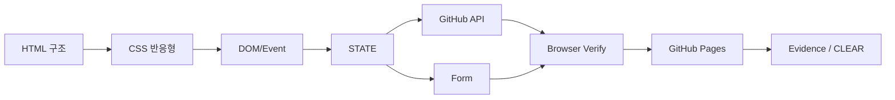

# B4-1 Round 01 — Beginner Guide

구분: **필수 미션 (REQUIRED)**  
Reference: **CORE READY**  
Runtime: **⬜ NOT STARTED**

> Phase C에서 이 순서대로 실제 수행합니다. Reference가 준비되어 있어도 브라우저/API/GitHub Pages 결과를 아직 PASS로 간주하지 않습니다.

## 전체 흐름



HTML이 구조, CSS가 표현, JavaScript가 사용자 이벤트와 상태 변화 및 화면 갱신을 담당합니다.

## STEP 01 — 공식 요구와 파일 구조
① 왜: 누락 없이 시작하기 위해서입니다.  
② 무엇: 공식 Mission/Evaluation과 Reference 구조를 확인합니다.  
③ 용어: 시맨틱 HTML(Semantic HTML) — 의미가 드러나는 태그 구조.  
④ 개념: HTML/CSS/JS는 책임을 분리합니다.  
⑤ 명령:
```bash
find training/round-01-clear/reference -maxdepth 3 -type f | sort
```
⑥ 주석: `index.html`, `css/style.css`, `js/script.js`, `images/`를 확인합니다.  
⑦ 정상: 필수 파일이 보입니다.  
⑧ 의미: 기준 구현 위치가 확정됩니다.  
⑨ 오류: 경로가 없으면 저장소 루트인지 확인합니다.  
⑩ 완료: `[ ] 구조를 찾았다.`

## STEP 02 — 로컬 웹서버와 정적 검증
① 왜: file:// 대신 HTTP 환경에서 브라우저 동작을 확인하기 위해서입니다.  
② 무엇: verifier와 로컬 서버를 준비합니다.  
③ 용어: 정적 검증(Static Verification) — 실행 전 구조/코드 조건 검사.  
④ 개념: 정적 검증은 브라우저 Runtime을 대체하지 않습니다.  
⑤ 명령:
```bash
bash training/round-01-clear/environment/verify.sh
cd training/round-01-clear/reference
python3 -m http.server 8000
```
⑥ 주석: 첫 명령은 구조, 두 번째는 로컬 HTTP 서버입니다.  
⑦ 정상: verify `0 FAIL`, 서버가 8000에서 대기합니다.  
⑧ 의미: Reference 구조를 브라우저에서 볼 준비가 됐습니다.  
⑨ 오류: 8000 사용 중이면 다른 포트를 사용합니다.  
⑩ 완료: `[ ] 실제 verify 결과를 기록했다.`

## STEP 03 — HTML과 접근성
① 왜: 화면 구조가 의미와 접근성을 가져야 합니다.  
② 무엇: semantic tags, section, alt, label을 확인합니다.  
③ 용어: 접근성(Accessibility), 레이블(Label).  
④ 개념: `label for`와 input `id`를 연결하면 입력 목적이 명확해집니다.  
⑤ 확인: 브라우저 개발자도구 Elements에서 `header/nav/main/section/article/footer`와 Contact form을 확인합니다.  
⑥ 주석: div만으로 구성하지 않습니다.  
⑦ 정상: Hero/About/Skills/Projects/Contact/Footer가 있습니다.  
⑧ 의미: 공식 HTML 요구를 충족하는 구조입니다.  
⑨ 오류: 이미지 alt나 label 연결 누락을 확인합니다.  
⑩ 완료: `[ ] semantic/accessibility를 확인했다.`

## STEP 04 — Mobile First / Flex / Grid
① 왜: 다양한 화면 크기에서 레이아웃이 유지되어야 합니다.  
② 무엇: 375px, 768px, 1024px 이상에서 확인합니다.  
③ 용어: 모바일 퍼스트(Mobile First), Flexbox, CSS Grid.  
④ 개념: nav는 1차원 정렬에 Flex, project cards는 2차원 반복 배치에 Grid를 사용합니다.  
⑤ 실행: DevTools Responsive Mode에서 viewport를 변경합니다.  
⑥ 주석: CSS breakpoints는 768px/1024px입니다.  
⑦ 정상: 모바일에서는 hamburger, 넓은 화면에서는 nav menu가 보입니다.  
⑧ 의미: 반응형 요구를 실제 확인했습니다.  
⑨ 오류: overflow와 menu visibility를 확인합니다.  
⑩ 완료: `[ ] 3개 viewport를 확인했다.`

## STEP 05 — Event → STATE → Render
① 왜: React 이전에 상태 기반 UI의 기본 원리를 이해하기 위해서입니다.  
② 무엇: `STATE`의 theme/projects/form/menu 흐름을 따라갑니다.  
③ 용어: 상태(State), 렌더(Render).  
④ 개념:
```text
사용자/네트워크 Event → STATE 변경 → render 함수 → DOM 변화
```
⑤ 확인: `js/script.js`의 `STATE`, `setTheme`, `setProjectsState`, `renderProjects`, form handlers를 확인합니다.  
⑥ 주석: 단순 변수보다 상태의 위치와 갱신 흐름을 추적하기 쉽습니다.  
⑦ 정상: 최소 theme/projects/form 3개 흐름을 설명할 수 있습니다.  
⑧ 의미: 평가의 상태 관리 항목과 연결됩니다.  
⑨ 오류: DOM을 직접 바꾸는 코드와 state 변경의 순서를 구분합니다.  
⑩ 완료: `[ ] 3개 흐름을 자기 말로 설명한다.`

## STEP 06 — 인터랙션과 Theme
① 왜: 클릭/스크롤/localStorage 동작을 확인합니다.  
② 무엇: hamburger, smooth scroll, nav 60px, top 300px, theme persistence, animation을 확인합니다.  
③ 용어: localStorage, IntersectionObserver.  
④ 개념: theme은 저장 상태, scroll UI는 현재 viewport 상태에 반응합니다.  
⑤ 실행: 직접 클릭/스크롤하고 theme을 바꾼 뒤 새로고침합니다.  
⑥ 주석: observer threshold는 `0.2`입니다.  
⑦ 정상: theme이 새로고침 후 유지됩니다.  
⑧ 의미: 브라우저 저장소와 이벤트 연결이 확인됩니다.  
⑨ 오류: DevTools Application > Local Storage를 확인합니다.  
⑩ 완료: `[ ] 모든 interaction을 실제 확인했다.`

## STEP 07 — GitHub API / 배열 메서드
① 왜: 비동기 API와 UI 상태를 학습합니다.  
② 무엇: loading → success/error/empty 흐름을 확인합니다.  
③ 용어: Fetch API, async/await, try/catch, map/filter/forEach.  
④ 개념: `filter()`는 fork 제외, `map()`은 repo→card 변환, `forEach()`는 DOM 부착에 사용합니다.  
⑤ 실행: Network 탭을 열고 Projects를 다시 불러옵니다.  
⑥ 주석: username은 HTML meta에서 설정합니다.  
⑦ 정상: loading 후 카드가 나타납니다. 오류 시 메시지와 `다시 시도` 버튼이 보입니다.  
⑧ 의미: 네트워크 상태를 UI 상태로 변환합니다.  
⑨ 오류: API rate limit/username/network를 확인합니다.  
⑩ 완료: `[ ] success와 오류/재시도를 검증했다.`

## STEP 08 — Contact Form
① 왜: 입력 즉시 유효성 피드백을 제공하기 위해서입니다.  
② 무엇: 빈 값, 잘못된 email, 짧은 값, 정상 제출을 시험합니다.  
③ 용어: 유효성 검사(Validation), `preventDefault`.  
④ 개념: input event → field validation/state → error DOM, submit → 전체 validation → result DOM.  
⑤ 실행: 폼에 여러 잘못된 값을 직접 입력한 뒤 정상값으로 수정합니다.  
⑥ 주석: 필수 미션에서는 실제 이메일 전송이 필요하지 않습니다.  
⑦ 정상: 필드 근처 오류와 정상 성공 메시지가 보입니다.  
⑧ 의미: form 상태→렌더 흐름이 확인됩니다.  
⑨ 오류: native validity와 minlength/type을 확인합니다.  
⑩ 완료: `[ ] invalid/valid를 모두 확인했다.`

## STEP 09 — GitHub Pages
① 왜: 최종 결과물은 외부 접속 가능한 URL이 필요합니다.  
② 무엇: 실제 제출용 위치에 정적 사이트를 두고 Pages를 활성화합니다.  
③ 용어: 정적 호스팅(Static Hosting), GitHub Pages.  
④ 개념: 로컬 통과와 배포 URL 통과는 별도 검증입니다.  
⑤ 실행: Phase C에서 GitHub Pages 설정 후 외부 URL을 브라우저에서 엽니다.  
⑥ 주석: Reference 단계에서는 배포됐다고 가정하지 않습니다.  
⑦ 정상: 외부 URL에서 CSS/JS/API가 정상입니다.  
⑧ 의미: 실제 배포 요구를 만족합니다.  
⑨ 오류: Pages source/path와 상대경로를 확인합니다.  
⑩ 완료: `[ ] 실제 URL을 기록했다.`

## STEP 10 — Evidence / Evaluation / CLEAR
① 왜: 코드 존재와 수행 완료를 구분하기 위해서입니다.  
② 무엇: browser/API/deploy/evaluation Evidence를 정리합니다.  
③ 용어: Evidence, CLEAR Gate.  
④ 개념: Requirement → Implementation → Verification → Evidence.  
⑤ 명령:
```bash
mkdir -p training/round-01-clear/evidence/runtime
bash training/round-01-clear/environment/verify.sh \
  | tee training/round-01-clear/evidence/runtime/verify.txt
bash training/round-01-clear/environment/verify.sh --runtime
```
⑥ 주석: `browser.md`, `api.md`, `deploy.md`, `evaluation.md`는 실제 확인 결과로 작성합니다.  
⑦ 정상: Runtime Gate가 `0 FAIL`.  
⑧ 의미: 자동/브라우저/API/배포/설명형 평가가 연결됐습니다.  
⑨ 오류: 실패한 Evidence 항목만 보완합니다.  
⑩ 완료: `[ ] ✅ B4-1 CLEAR 조건을 모두 충족했다.`
